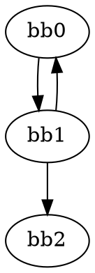

# Cyclomatic Complexity from Rust MIR `.dot` — Script Guide

This document explains how the provided Python script computes McCabe’s **Cyclomatic Complexity (CC)** from Rust **MIR** Graphviz files (`.after.dot`) and clarifies what is considered a **node** and an **edge** for the calculation.

---

## 1) What the script does

- Walks a folder recursively, finds files ending with `*.after.dot` (MIR dumps).
- For each file, extracts **basic blocks** and **control‑flow edges** from Graphviz content using regular expressions.
- Computes **Cyclomatic Complexity** per file using the classical formula  
  **CC = E − N + 2P**, where:
  - **N** = number of nodes
  - **E** = number of edges
  - **P** = number of connected components in the control‑flow graph (CFG)
- Writes results to:
  - `cc_summary.json` (per‑file complexity + repo total)
  - `cc_summary.csv` (tabular view per file)

> The script guarantees a minimum complexity of **1** per file (never returns 0).

---

## 2) Inputs & outputs

### Inputs
- A directory containing Rust MIR `.after.dot` files (e.g., produced with `RUSTC` flags that dump MIR).

### Outputs
- **JSON**: `cc_summary.json`
  ```json
  {
    "some_file.after.dot": { "total_tcc": 7 },
    "another_file.after.dot": { "total_tcc": 3 },
    "total_repo_tcc": 10
  }
  ```
- **CSV**: `cc_summary.csv`
  ```csv
  File .dot,New Tcc
  some_file.after.dot,7
  another_file.after.dot,3
  ```

> The JSON includes a top‑level key `total_repo_tcc` with the sum across files; the CSV lists only the per‑file values.

---

## 3) Usage (CLI)

```bash
python analyze_cc_from_dot.py <path_to_mir_dump>
```

**Arguments**
- `<path_to_mir_dump>`: the root folder where your `.after.dot` files live.
  - The script will error if this is not a valid directory.

**Example**
```bash
python analyze_cc_from_dot.py ./target/mir_dumps
# -> creates cc_summary.json and cc_summary.csv in the current directory
```

---

## 4) How nodes and edges are detected

The script uses two regular expressions over the DOT file text:

### Nodes (basic blocks)
```python
node_def_re = re.compile(r'^\s*(bb[^\s\[]+)\s*\[', re.MULTILINE)
```
- **Matches** graph nodes whose identifier **starts with `bb`** (e.g., `bb0`, `bb10`, `bb0[stack]` would match the `bb0` part).
- The capture is the block name before the first `[` (Graphviz attributes) or whitespace.
- **Why**: MIR basic blocks are emitted with `bb…` names; this avoids counting non‑block DOT nodes (labels, clusters, etc.).

### Edges (control‑flow)
```python
edge_re = re.compile(r'^\s*(bb[^\s\[]+)\s*->\s*(bb[^\s\[]+)', re.MULTILINE)
```
- **Matches** Graphviz edges **from one `bb…` to another** (e.g., `bb0 -> bb1`, `bb2->bb3`).
- Each match records a directed edge `(src, dst)` in the **edges set**.
- The script also **adds both endpoints** to the **nodes set** to ensure nodes referenced only by edges are counted.

---

## 5) Connected components `P`

To compute **P** (number of connected components), the script **temporarily treats the graph as undirected**:

```python
adj[s].add(d)
adj[d].add(s)  # undirected for component counting
```

- This ensures two blocks are in the same component if **either** can reach the other (directly or indirectly).
- A standard DFS over this undirected view counts distinct components.
- **Safety rule**: if the file has nodes but the computed `P` is `0`, the script forces `P = 1`.
- **Rationale**: In most MIR dumps you’ll have a single CFG per function/file; however, depending on how dumps were generated or merged, a DOT file **can** contain multiple disjoint subgraphs (e.g., multiple functions). In such a case, `P` correctly reflects multiple components.

---

## 6) Complexity formula and return value

For each file:
```
N = number of unique bb… nodes
E = number of unique bb… -> bb… edges
P = number of connected components (in the undirected view)

CC = E − N + 2P
CC ≥ 1  (the script returns max(CC, 1))
```
- If a file contains **no nodes** (`N == 0`), complexity is returned as **0**.
- Otherwise, complexity is at least **1**. This mirrors common tooling conventions where an empty or trivial function is assigned 1 as a baseline.

---

## 7) Example (toy DOT)

**Input (`example.after.dot`)**


**Counts**
- Nodes `N = 3` → `{bb0, bb1, bb2}`
- Edges `E = 3` → `{(bb0,bb1), (bb1,bb2), (bb1,bb0)}`
- Components `P = 1` (all reachable when viewed undirected)

**Complexity**
```
CC = E − N + 2P = 3 − 3 + 2*1 = 2
```

---

## 8) Folder analysis behavior

- The script **recursively** walks the given folder.
- It processes **only** files with the suffix `".after.dot"`.
- For each file, it stores:
  ```json
  "<filename>.after.dot": { "total_tcc": <CC> }
  ```
- It also aggregates `total_repo_tcc` as the **sum of all per‑file CC** values.

---
